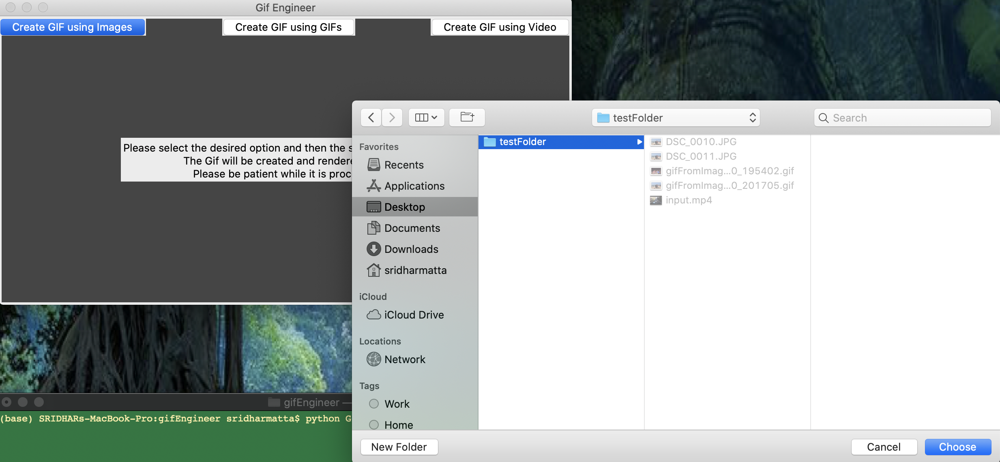

<b>gifEngineer:</b>
A desktop application built on python for creating GIF

TABLE OF CONTENTS

 <pre> INTRODUCTION </pre>
<pre> SPECIFICATIONS </pre>
<pre> SOFTWARES REQUIRED </pre>
<pre> SOURCE CODE </pre>
<pre> INSTALLATION NOTES </pre>
<pre> ABOUT THE APPLICATION </pre>

INTRODUCTION\
 This desktop application allows the user to create GIF using a set of Images or Gifs or a Video file.
  
<b>Check out this video to see the demo.</b>

<!--  -->
<pre><i>If the above video doesn't seem to work, you can find the same clip of Demo at (~/readme_figs/DemoVideos/FortuneWheelDemo.mov) location.</i></pre>

SPECIFICATIONS

 <pre>A desktop application that accepts a directory/folder containing Images or Gifs. Alternatively, it also accepts a video clip/file:</pre>
<ul>
<li> Display a button "Create GIF using Images" in the Top Left to allow user to select a Folder/Directory containing images and form a GIF.</li>
<li> Display a button "Create GIF using GIFs" in the Top Center to allow user to select a Folder/Directory containing GIFs and form a GIF.</li>
<li> Display a button "Create GIF using Video"  in the Top Right to allow user to select a video file and form a GIF.</li>
<li> Display a button "Save GIF @" to save rendered GIF in the user selected destination folder/directory.</li>
<li> Display a button "Cancel/Delete Saved GIF" to cancel and delete the created GIF along with other temporary files/folders created.</li>
<li> Delete all created temporary files/folders if any upon application exit.</li>
</ul>
<pre>When the User presses the "Create GIF using Images" button:</pre>
<ul>
<li> Show the File/Folder selection dialog to select the Folder/Directory containing images.</li>
<li> Create the GIF using images available in the selected folder.</li>
</ul>
<pre>When the User presses the "Create GIF using GIFs" button:</pre>
<ul>
<li> Show the File/Folder selection dialog to select the Folder/Directory containing Gifs.</li>
<li> Create the GIF using Gifs available in the selected folder by converting the Gif into individual images.</li>
</ul>
<pre>When the User presses the "Create GIF using Video" button:</pre>
<ul>
<li> Show the File/Folder selection dialog to select the video file.</li>
<li> Create the GIF using Video file.</li>
</ul>

SOFTWARES REQUIRED\
 The software that are needed for the application to be edited or executed

<ul>
<li> OPERATING SYSTEM UTILIZED: MAC OS- Catalina </li>
<li> ‘technology’ --> python</li>
<li> ‘build tools’ --> pyinstaller, py2app</li>
</ul>

SOURCE CODE\
 The Source code for the application is in the 'gifEngineer folder

<ul>
<li> ‘GifEngineer.py’ & 'GifEngineerHandler.py' --> These files have the source code for the application which renders the frontend UI and creates/forms the GIF.</li>
<li> 'dist' --> This folder has the executables.</li>
</ul>

INSTALLATION NOTES\
 All the execution of this application will be done via command prompt terminal. <b>Assuming you have Python and pip already installed</b>

<ol type="A">
<li> GifEngineer Application’ </li>
	<ul>
		<li> Navigate into your /GifEngineer/ </li>
		<li> Run the application: <b>python GifEngineer.py</b></li>
	</ul>
<li> Installing Dependencies </li>
	<ul>
		<li> Navigate into your /GifEngineer/ </li>
		<li> Double the following file: <b>dependencies_install.bat</b></li>
	</ul>
<li> ‘Build’ </li>
	<ul>
		<li> Navigate into your /GifEngineer/ </li>
		<li> Run the following command for Mac OS executable:  <b>python setup.py py2app</b></li>
		<li> Run the following command for Windows OS executable:  <b>pyinstaller --onefile -w GifEngineer.py</b></li>
	</ul>
	</ol>

ABOUT THE APPLICATION\
 This application opens up a window after you have installed and initiated the step given in the ‘INSTALLATION NOTES’ section(except the 'Build' section if you are running it locally).
The application loads and opens up a desktop window with only the "Create GIF using Images", "Create GIF using GIFs", "Create GIF using Video" buttons and the waiting text displayed. Figure 1 shows the screen when the application is loaded.

    Figure 1: Start-up Screen

Figures 2 & 3 shows the dialogs we have for creating GIF using Images/Gifs and Video

    Figure 2: Display of the dialog for creating GIF using Images/Gifs.

    Figure 3: Display of the dialog for creating GIF using Video.

    Figure 4: Display of the GIF and 'Save GIF @' or 'Cancel/Delete Saved GIF' options.

    Figure 5: Display of the dialog for saving the created GIF.

The developer can run the Build commands and the respective executables will be created in the '/dist' location, a folder each for respective target OS.
